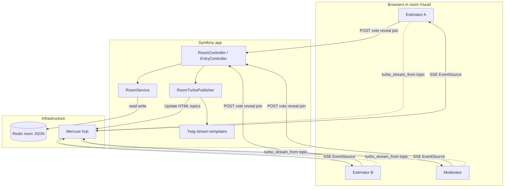
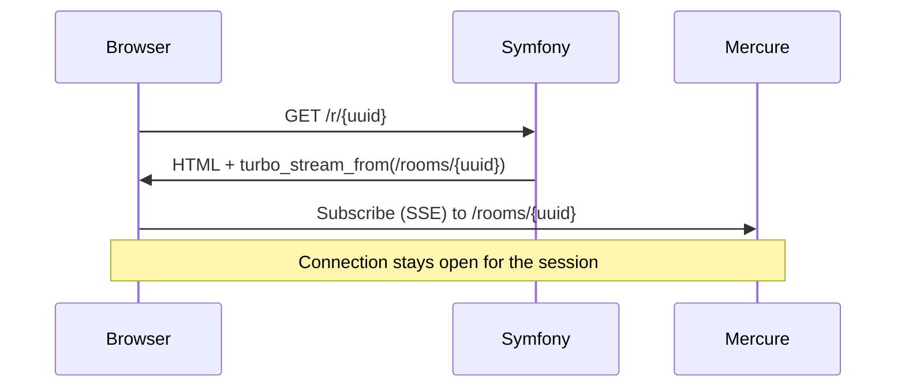
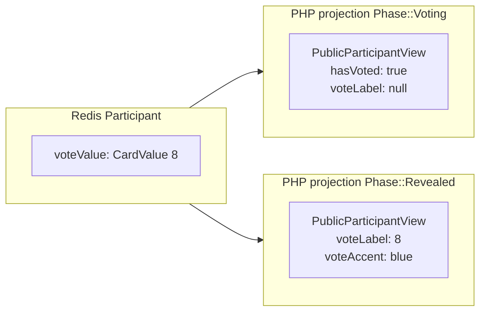
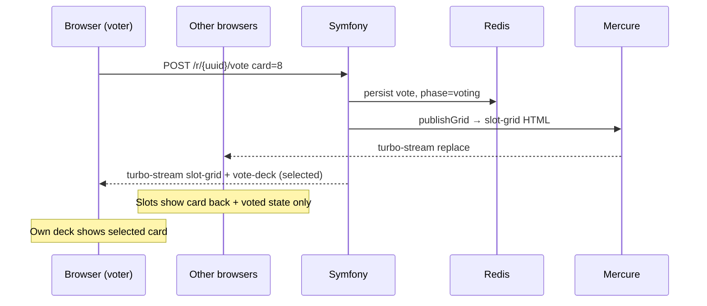
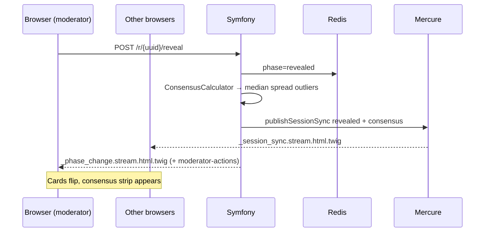
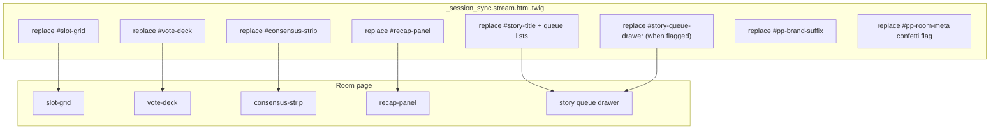
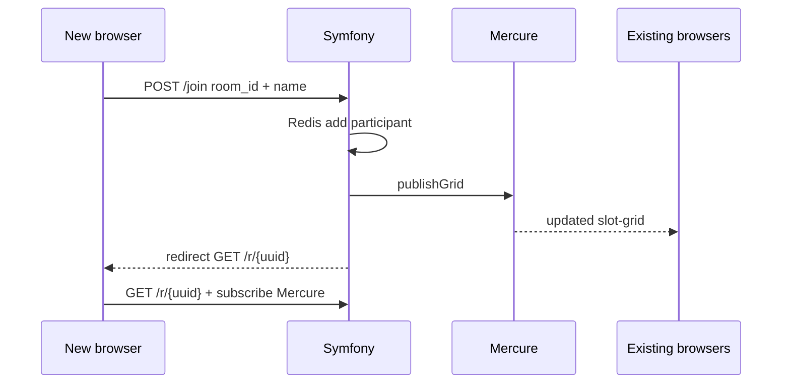

# Realtime sync (Mercure + Turbo)

Poker Planner keeps every browser in a room aligned without polling. **Symfony Mercure** delivers HTML fragments; **UX Turbo** applies them as DOM updates. Vote values never appear in Mercure payloads until the moderator reveals.

## System overview



| Layer | Responsibility |
|-------|----------------|
| **Redis** | Source of truth — `Room`, participants, votes, story queue |
| **PHP controllers** | Validate actions, mutate Redis, render Turbo streams for the acting browser |
| **RoomTurboPublisher** | Render the same stream HTML and `HubInterface::publish()` to other browsers |
| **Mercure** | Fan-out one HTML payload to every subscriber on the room topic |
| **Turbo** | Parse `<turbo-stream>` elements and replace DOM targets by `id` |

## Room topic subscription

Each room page opens one Mercure subscription via UX Turbo:

```twig
{# templates/room/show.html.twig #}
{{ turbo_stream_from(mercure_topic) }}
```

The topic is built server-side:

```text
{mercure_topic_prefix}/rooms/{roomUuid}
```

Example with default config: `/rooms/550e8400-e29b-41d4-a716-446655440000`.



Subscriptions are **public** (`private: false` on publish). Room UUID acts as the capability — only people with the link join.

## Vote privacy model

During **voting** phase, Mercure payloads use `PublicParticipantView`: display name, moderator flag, and `hasVoted` — never the card value.



After **reveal**, the same projection includes `voteLabel`, `voteAccent`, and optional icon (`?`, coffee).

The acting voter always gets a **direct Turbo response** on their POST (selected card on the deck). Everyone else learns only from Mercure — still no leaked values until reveal.

## Vote flow (one estimator)



`publishGrid` renders `_slot_grid.stream.html.twig` — participant grid only.

## Reveal flow (moderator)

Reveal is a **session sync**: grid, deck, consensus strip, recap, story chrome, and moderator buttons update together.



## Turbo DOM targets

Session sync replaces multiple elements by stable `id`:



| Stream template | Typical trigger | Mercure? | Also returns to actor? |
|-----------------|-----------------|----------|----------------------|
| `_slot_grid.stream` | vote, clear, rename, join | yes (`publishGrid`) | vote/clear: `_vote_update` |
| `_session_sync.stream` | reveal, restart, next story, settings, new session | yes (`publishSessionSync`) | reveal/restart/next: `_phase_change` |
| `_story_audience.stream` | story title / queue edits | yes (`publishStory`) | `_story.stream` to moderator UI |
| `_phase_change.stream` | moderator phase actions | via included session sync | yes |
| `_moderator_actions.stream` | reveal, restart, next | bundled in phase change | moderator only |

## Publisher API

`RoomTurboPublisher` centralizes Mercure publishes:

| Method | Renders | Publishes when |
|--------|---------|----------------|
| `publishGrid($room)` | `_slot_grid.stream` | Vote, clear, rename, join |
| `publishSessionSync($room, $revealed, $consensus, $refreshQueue)` | `_session_sync.stream` | Reveal, restart, next, settings, archive queue |
| `publishStory($room)` | `_story_audience.stream` | Story title / queue add / remove |

Publish errors are logged and swallowed so a down Mercure hub does not break POST handlers.

## Join flow

New participants trigger `publishGrid` from `EntryController::join` so existing estimators see an extra slot without refreshing.



## Heartbeat (not Mercure)

Presence uses HTTP POST, not Mercure:

```text
POST /r/{uuid}/heartbeat  →  RoomService::heartbeat  →  Redis lastSeen
```

Stimulus on the room page fires on an interval from `heartbeat_seconds`. Missed heartbeats plus `grace_seconds` remove ghost participants on the next grid publish.

## Failure modes

| Symptom | Likely cause |
|---------|----------------|
| Others never see votes | Mercure hub down, wrong `MERCURE_PUBLIC_URL`, or publish JWT |
| Only actor updates | Subscriber not connected — check browser devtools EventSource |
| Stale roster | Heartbeat / grace — participant dropped after idle |
| Works locally, not in prod | Reverse proxy must expose `/.well-known/mercure` to browsers |

## See also

- [Configuration](configuration.md) — `mercure_topic_prefix`, heartbeat TTL
- [Quick start](quickstart.md) — moderator workflow
- [Symfony Mercure](https://symfony.com/doc/current/mercure.html)
- [UX Turbo streams](https://symfony.com/bundles/ux-turbo/current/index.html#turbo-streams)
